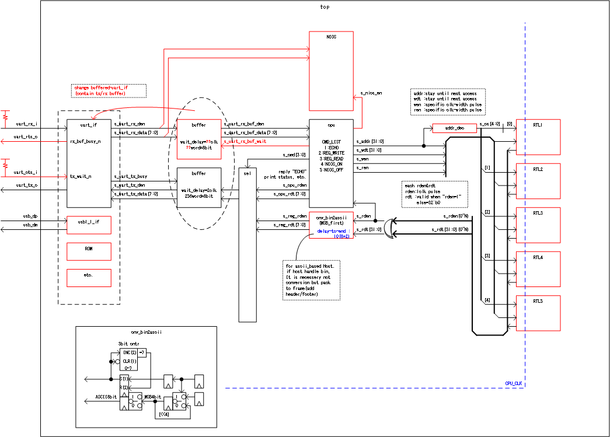

# uart_de0_nano
ascii text based processor in de0-nano fpga board by uart interface.

this project is based on Intel Quartus Prime 18.1 lite Edition.(free edition)  
(contain Modelsim - Intel FPGA Starter Edition 10.5b)

## directory description
  constraints : Quartus constraints files.  
  modelsim    : Modelsim simulation batch files.  
  modelsim_lib: Quartus library files for modelsim.  
*there is lib file list only(cannot compile)*  
*copy origin file from Intel Quartus Tools.(use python script)*  
  source      : RTL source code.  
  testbench   : bench env for simulation(cannot synthesis).  
  .qpf        : Quartus Project File.  
  .qsf        : Quartus Settings File.  

## block diagram
*red marking is T.B.D*

